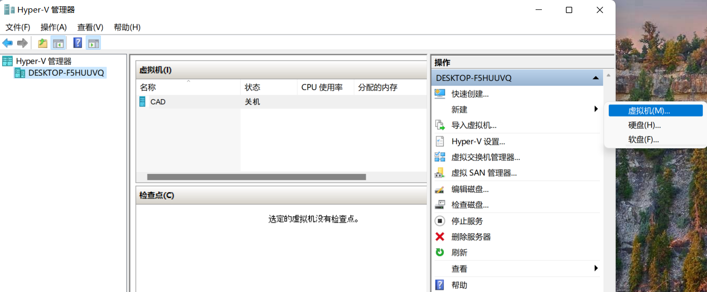
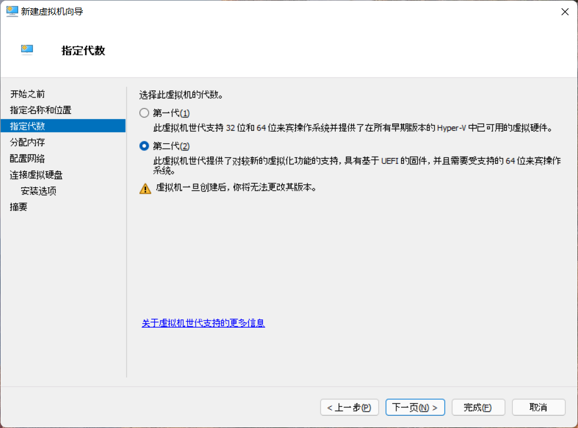
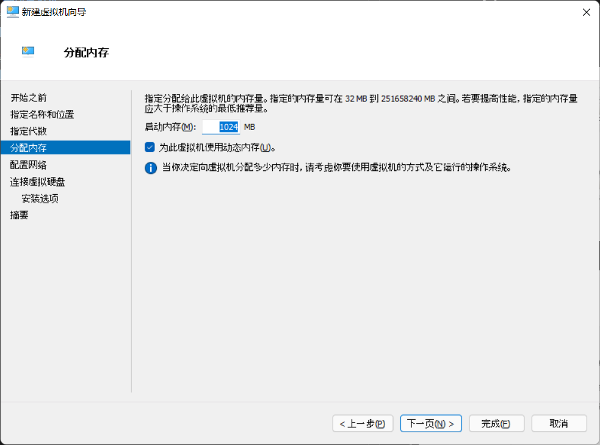
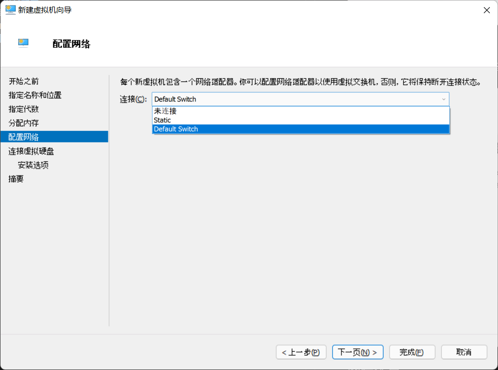
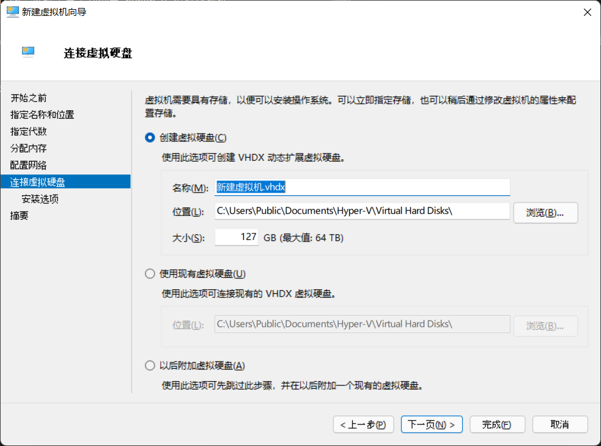
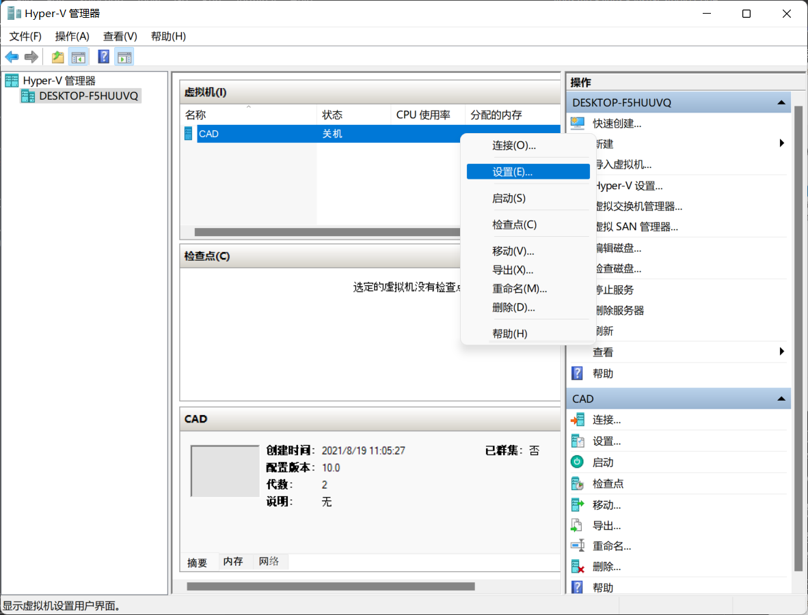
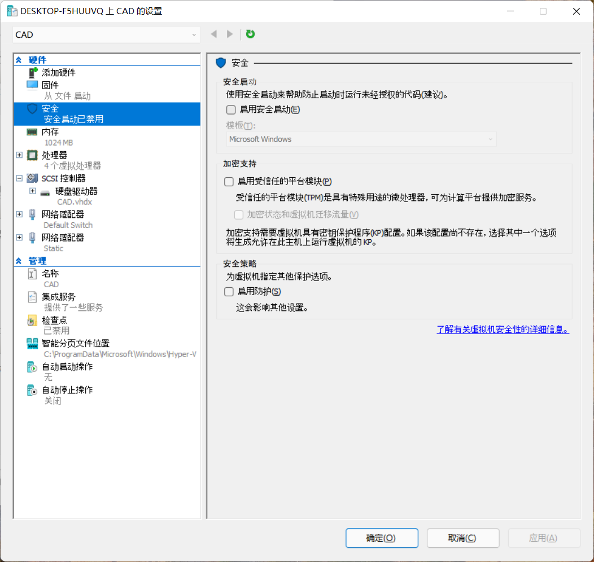
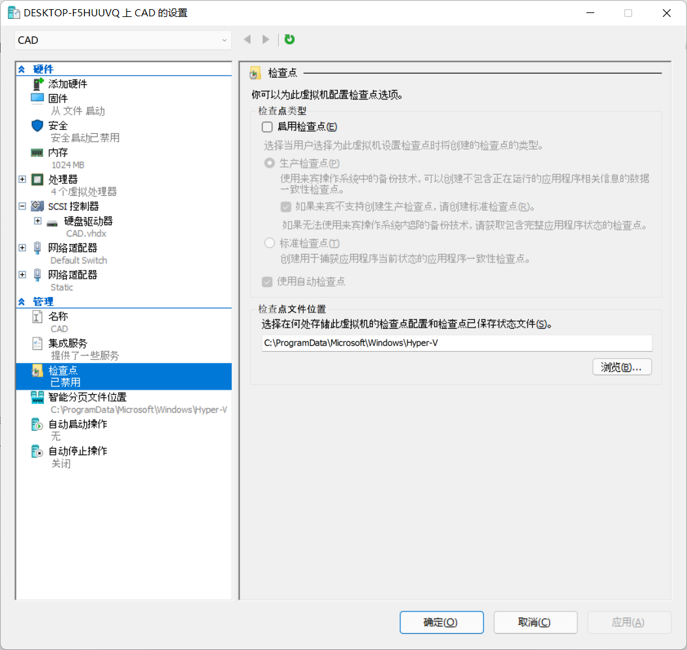

# 配置 Hyper-V Linux 虚拟机
## 新建虚拟机
选择：新建 > 虚拟机

## 代数选择
选择：第二代虚拟机\
少数古代系统只能在第一代虚拟机上运行。

## 内存配置
如果虚拟机无需使用图形界面，建议至少分配 1GB 内存。如需使用GUI桌面，建议至少分配 4GB 内存。动态内存分配最好打开。

## 网络配置
建议将虚拟机连接到 default switch，这样配置较为简单。

### 常见问题
某些操作系统版本（如 Windows Server）没有预设 default switch。这时需要手动创建 hyper-v 虚拟交换机。

## 虚拟硬盘配置
虚拟硬盘是宿主机（host）文件系统里的一个（或多个）文件。虚拟机（guest）的文件系统即储存在这些虚拟硬盘文件中。

根据自己的需要，创建新的虚拟硬盘，或者使用已有的虚拟硬盘。

## 关闭安全启动
现在还不能直接安装或者启动 Linux 虚拟机，因为 Hyper-V 默认开启了安全启动。安全启动开启时，只有经过微软签名的系统才能启动。为了顺利启动/安装 Linux 虚拟机，可以关闭这个功能。

右键单击刚才创建的虚拟机，选择设置。

进入：设置 > 硬件 > 安全，取消勾选安全启动。

## 禁用检查点（可选）
Hyper-V 默认开启检查点功能，相当与自动备份。此功能会占用额外的硬盘空间。如果不需要，可以关闭。

进入：设置 > 管理 > 检查点，取消勾选检查点。
