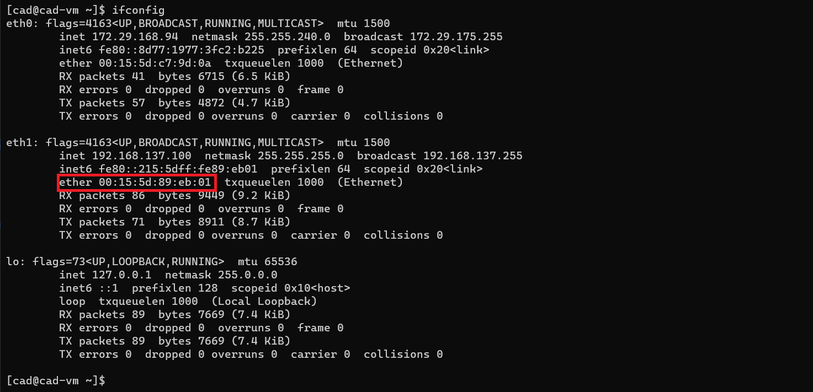
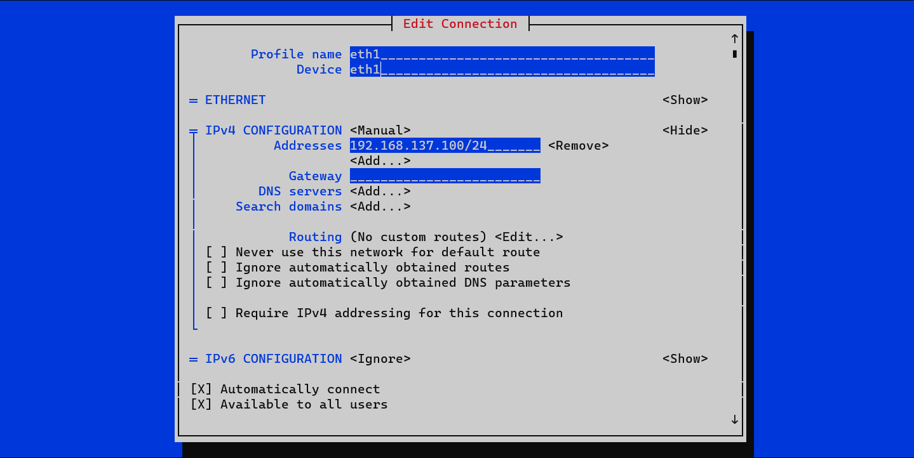

# Hyper-V 配置静态 IP
## 双网卡静态 IP 方案
使用虚拟机时，往往需要虚拟机能访问互联网，同时也有一个静态的内网 IP 方便从宿主机访问。然而，Hyper-V 似乎不支持虚拟机通过静态 IP 连接到互联网。对此，一个简单的解决方案是添加两块虚拟网卡。一块网卡使用动态 IP，用于访问互联网；另一块网卡使用静态 IP，方便从宿主机访问。这里假设虚拟机已经通过 default switch 或类似方案连接互联网。 
### 配置 Hyper-V 管理器
1. 打开 Hyper-V 管理器，选择“虚拟交换机管理器”。

2. 选择“新建虚拟网络交换机”，类型为“内部”。这个交换机将用于


3. 选择需要配置静态 IP 的虚拟机，进入“设置-添加硬件”，添加一个“网络适配器”，也就是常说的虚拟网卡。

4. 选择刚才创建的虚拟网卡，将其连接到之前创建的“内部”虚拟交换机上。

### 配置虚拟机（以 CentOS 7 为例）
CentOS 7 使用 NetworkManager 管理网络。其他操作系统虽然思路一致，但还需要自行搜索具体的配置方法。
1. 记录网卡的 MAC。\
   启动虚拟机。选择需要配置静态 IP 的虚拟机，进入“设置”，选择刚才创建的虚拟网卡，选择“高级功能”，记录下虚拟网卡的 MAC 地址。
    
2. 找到对应的网卡。\
   在终端运行 ifconfig。
    ```shell 
    $ ifconfig
    ```
    在终端打开 nmtui。选择“Edit a Connection”。找到与上一步记下的 MAC 地址相同的网卡。本图中，对应的网卡是“eth1”。
    
3. 在终端运行 nmtui，选择“Edit a connection”。
    ```shell
    $ nmtui
    ```
    
    选择“Add-Ethernet”。
    
    进行如图配置（以 192.168.137.0/24 网段为例，需要使用其他网段或 IP 可自行修改；Profile Name 可以随便起）。
    
    退回主菜单，选择“Activate a connection”，启用刚才创建的连接。
    
### 配置 Windows 宿主机
1. 打开“控制面板-网络和Internet-网络和共享中心-更改适配器设置”。
    
    
    
2. 选择需要配置静态 IP 的虚拟交换机，进入“属性-网络-IPv4”，进行如图配置。\
    如需更换 IP / 网段，确保 Windows 宿主机和虚拟机在同一子网下。
    

### 验证
#### 方法一：ssh（需要在虚拟机上正确设置 sshd 和防火墙）
```shell
$ ssh $USERNAME@192.168.137.100
```
图中用户名为“cad”，需要改成虚拟机上的用户名。

#### 方法二：ping（需要在虚拟机上正确设置防火墙）
